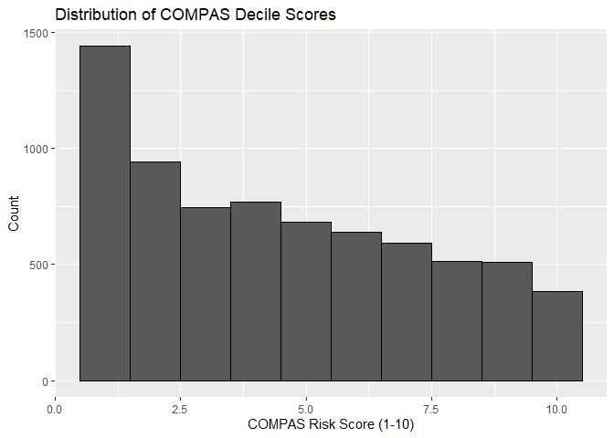
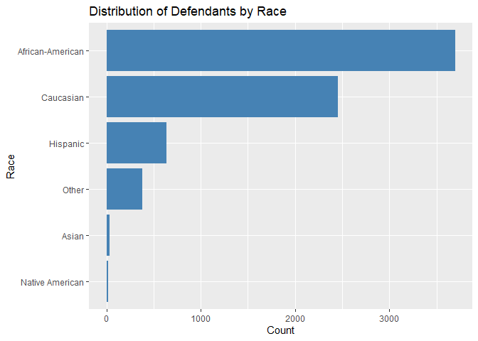
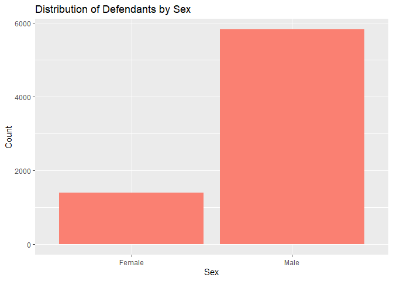
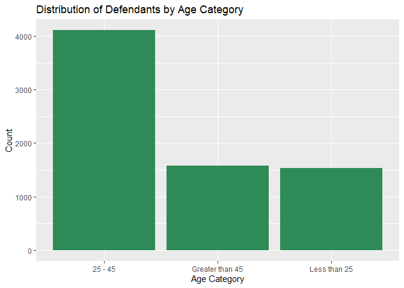
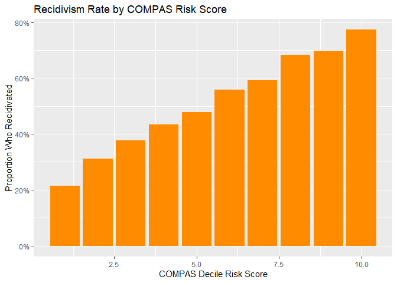
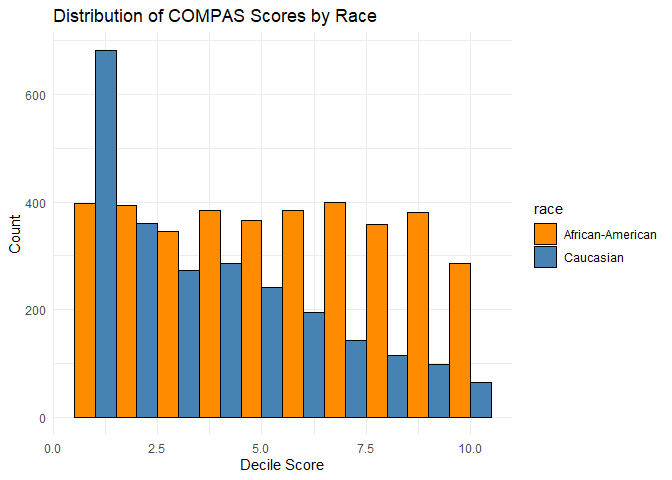
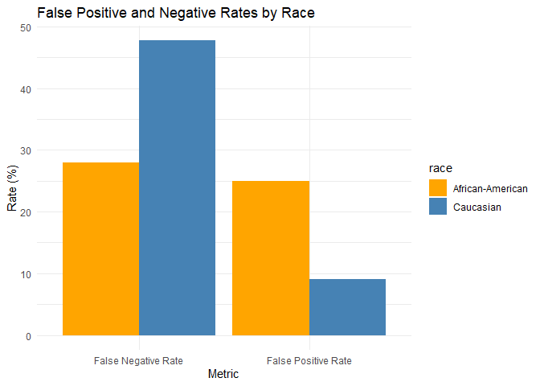
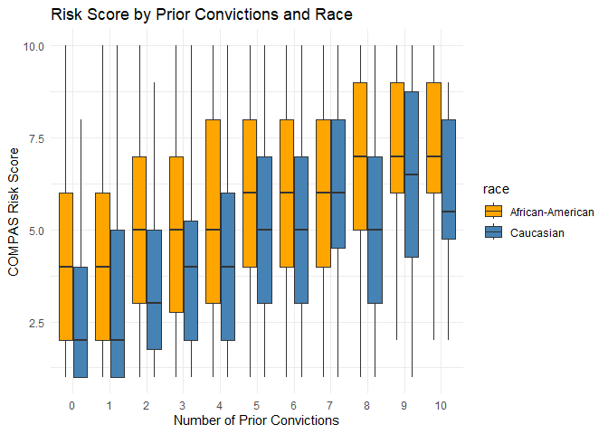
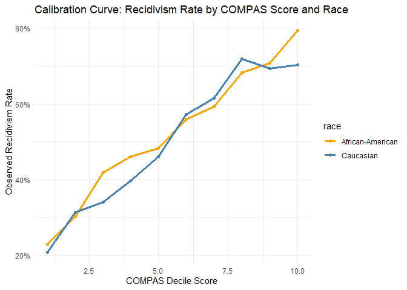

Lab 09: Algorithmic Bias
================
Jamieson Nathan
04/20/2025

``` r
library(tidyverse)
library(janitor)
```

``` r
compas <- read_csv("data/compas-scores-2-years.csv") %>%
  clean_names() %>% 
  rename(decile_score = decile_score_12,
         priors_count = priors_count_15)

glimpse(compas)
```

    ## Rows: 7,214
    ## Columns: 53
    ## $ id                      <dbl> 1, 3, 4, 5, 6, 7, 8, 9, 10, 13, 14, 15, 16, 18…
    ## $ name                    <chr> "miguel hernandez", "kevon dixon", "ed philo",…
    ## $ first                   <chr> "miguel", "kevon", "ed", "marcu", "bouthy", "m…
    ## $ last                    <chr> "hernandez", "dixon", "philo", "brown", "pierr…
    ## $ compas_screening_date   <date> 2013-08-14, 2013-01-27, 2013-04-14, 2013-01-1…
    ## $ sex                     <chr> "Male", "Male", "Male", "Male", "Male", "Male"…
    ## $ dob                     <date> 1947-04-18, 1982-01-22, 1991-05-14, 1993-01-2…
    ## $ age                     <dbl> 69, 34, 24, 23, 43, 44, 41, 43, 39, 21, 27, 23…
    ## $ age_cat                 <chr> "Greater than 45", "25 - 45", "Less than 25", …
    ## $ race                    <chr> "Other", "African-American", "African-American…
    ## $ juv_fel_count           <dbl> 0, 0, 0, 0, 0, 0, 0, 0, 0, 0, 0, 0, 0, 0, 0, 0…
    ## $ decile_score            <dbl> 1, 3, 4, 8, 1, 1, 6, 4, 1, 3, 4, 6, 1, 4, 1, 3…
    ## $ juv_misd_count          <dbl> 0, 0, 0, 1, 0, 0, 0, 0, 0, 0, 0, 0, 0, 0, 0, 0…
    ## $ juv_other_count         <dbl> 0, 0, 1, 0, 0, 0, 0, 0, 0, 0, 0, 0, 0, 0, 0, 0…
    ## $ priors_count            <dbl> 0, 0, 4, 1, 2, 0, 14, 3, 0, 1, 0, 3, 0, 0, 1, …
    ## $ days_b_screening_arrest <dbl> -1, -1, -1, NA, NA, 0, -1, -1, -1, 428, -1, 0,…
    ## $ c_jail_in               <dttm> 2013-08-13 06:03:42, 2013-01-26 03:45:27, 201…
    ## $ c_jail_out              <dttm> 2013-08-14 05:41:20, 2013-02-05 05:36:53, 201…
    ## $ c_case_number           <chr> "13011352CF10A", "13001275CF10A", "13005330CF1…
    ## $ c_offense_date          <date> 2013-08-13, 2013-01-26, 2013-04-13, 2013-01-1…
    ## $ c_arrest_date           <date> NA, NA, NA, NA, 2013-01-09, NA, NA, 2013-08-2…
    ## $ c_days_from_compas      <dbl> 1, 1, 1, 1, 76, 0, 1, 1, 1, 308, 1, 0, 0, 1, 4…
    ## $ c_charge_degree         <chr> "F", "F", "F", "F", "F", "M", "F", "F", "M", "…
    ## $ c_charge_desc           <chr> "Aggravated Assault w/Firearm", "Felony Batter…
    ## $ is_recid                <dbl> 0, 1, 1, 0, 0, 0, 1, 0, 0, 1, 0, 1, 0, 0, 1, 1…
    ## $ r_case_number           <chr> NA, "13009779CF10A", "13011511MM10A", NA, NA, …
    ## $ r_charge_degree         <chr> NA, "(F3)", "(M1)", NA, NA, NA, "(F2)", NA, NA…
    ## $ r_days_from_arrest      <dbl> NA, NA, 0, NA, NA, NA, 0, NA, NA, 0, NA, NA, N…
    ## $ r_offense_date          <date> NA, 2013-07-05, 2013-06-16, NA, NA, NA, 2014-…
    ## $ r_charge_desc           <chr> NA, "Felony Battery (Dom Strang)", "Driving Un…
    ## $ r_jail_in               <date> NA, NA, 2013-06-16, NA, NA, NA, 2014-03-31, N…
    ## $ r_jail_out              <date> NA, NA, 2013-06-16, NA, NA, NA, 2014-04-18, N…
    ## $ violent_recid           <lgl> NA, NA, NA, NA, NA, NA, NA, NA, NA, NA, NA, NA…
    ## $ is_violent_recid        <dbl> 0, 1, 0, 0, 0, 0, 0, 0, 0, 1, 0, 0, 0, 0, 0, 0…
    ## $ vr_case_number          <chr> NA, "13009779CF10A", NA, NA, NA, NA, NA, NA, N…
    ## $ vr_charge_degree        <chr> NA, "(F3)", NA, NA, NA, NA, NA, NA, NA, "(F2)"…
    ## $ vr_offense_date         <date> NA, 2013-07-05, NA, NA, NA, NA, NA, NA, NA, 2…
    ## $ vr_charge_desc          <chr> NA, "Felony Battery (Dom Strang)", NA, NA, NA,…
    ## $ type_of_assessment      <chr> "Risk of Recidivism", "Risk of Recidivism", "R…
    ## $ decile_score_40         <dbl> 1, 3, 4, 8, 1, 1, 6, 4, 1, 3, 4, 6, 1, 4, 1, 3…
    ## $ score_text              <chr> "Low", "Low", "Low", "High", "Low", "Low", "Me…
    ## $ screening_date          <date> 2013-08-14, 2013-01-27, 2013-04-14, 2013-01-1…
    ## $ v_type_of_assessment    <chr> "Risk of Violence", "Risk of Violence", "Risk …
    ## $ v_decile_score          <dbl> 1, 1, 3, 6, 1, 1, 2, 3, 1, 5, 4, 4, 1, 2, 1, 2…
    ## $ v_score_text            <chr> "Low", "Low", "Low", "Medium", "Low", "Low", "…
    ## $ v_screening_date        <date> 2013-08-14, 2013-01-27, 2013-04-14, 2013-01-1…
    ## $ in_custody              <date> 2014-07-07, 2013-01-26, 2013-06-16, NA, NA, 2…
    ## $ out_custody             <date> 2014-07-14, 2013-02-05, 2013-06-16, NA, NA, 2…
    ## $ priors_count_49         <dbl> 0, 0, 4, 1, 2, 0, 14, 3, 0, 1, 0, 3, 0, 0, 1, …
    ## $ start                   <dbl> 0, 9, 0, 0, 0, 1, 5, 0, 2, 0, 0, 4, 1, 0, 0, 0…
    ## $ end                     <dbl> 327, 159, 63, 1174, 1102, 853, 40, 265, 747, 4…
    ## $ event                   <dbl> 0, 1, 0, 0, 0, 0, 1, 0, 0, 1, 0, 1, 0, 0, 1, 1…
    ## $ two_year_recid          <dbl> 0, 1, 1, 0, 0, 0, 1, 0, 0, 1, 0, 1, 0, 0, 1, 1…

### Exercise 1

``` r
nrow(compas)  
```

    ## [1] 7214

``` r
ncol(compas)  
```

    ## [1] 53

``` r
n_distinct(compas$name)
```

    ## [1] 7158

``` r
compas %>%
  ggplot(aes(x = decile_score)) +
  geom_histogram(binwidth = 1, color = "black") +
  labs(title = "Distribution of COMPAS Decile Scores",
       x = "COMPAS Risk Score (1-10)",
       y = "Count")
```

<!-- -->

``` r
compas %>%
  count(race) %>%
  ggplot(aes(x = fct_reorder(race, n), y = n)) +
  geom_col(fill = "steelblue") +
  coord_flip() +
  labs(title = "Distribution of Defendants by Race", x = "Race", y = "Count")
```

<!-- -->

``` r
compas %>%
  count(sex) %>%
  ggplot(aes(x = sex, y = n)) +
  geom_col(fill = "salmon") +
  labs(title = "Distribution of Defendants by Sex", x = "Sex", y = "Count")
```

<!-- -->

``` r
compas %>%
  count(age_cat) %>%
  ggplot(aes(x = age_cat, y = n)) +
  geom_col(fill = "seagreen") +
  labs(title = "Distribution of Defendants by Age Category", x = "Age Category", y = "Count")
```

<!-- -->

Each row refers to the number of observations, each column represents
the number of variables. The discrepancy between number of unique
defendants and number of observations could be due to error or due to
recidivism. Based on the histogram, it appears that high COMPAS risk
scores occur much less frequently than lower scores.

## Exercise 2

``` r
compas %>%
  group_by(decile_score) %>%
  summarize(
    recid_rate = mean(two_year_recid, na.rm = TRUE),
    count = n()
  ) %>%
  ggplot(aes(x = decile_score, y = recid_rate)) +
  geom_col(fill = "darkorange") +
  labs(
    title = "Recidivism Rate by COMPAS Risk Score",
    x = "COMPAS Decile Risk Score",
    y = "Proportion Who Recidivated"
  ) +
  scale_y_continuous(labels = scales::percent_format())
```

<!-- -->

``` r
compas %>%
  mutate(
    prediction_correct = case_when(
      decile_score >= 7 & two_year_recid == 1 ~ TRUE,
      decile_score <= 4 & two_year_recid == 0 ~ TRUE,
      TRUE ~ FALSE
    )
  ) %>%
  summarize(
    correct_predictions = sum(prediction_correct, na.rm = TRUE),
    total = n(),
    accuracy = correct_predictions / total
  )
```

    ## # A tibble: 1 × 3
    ##   correct_predictions total accuracy
    ##                 <int> <int>    <dbl>
    ## 1                4032  7214    0.559

The plot shows a clear upward trend in recidivism rates as COMPAS risk
scores increase, which supports some predictive validity. The higher the
score, the higher the proportion of defendants who recidivate.

The COMPAS algorithm correctly classified about 55.9% of the cases using
the binary criteria (high score & recidivate OR low score & did not
recidivate). This is better than chance, but still leaves ~44% of
predictions incorrect, which is a significant margin for decisions that
may affect sentencing or parole.

### Exercise 3

``` r
compas %>%
  filter(race %in% c("African-American", "Caucasian")) %>%
  ggplot(aes(x = decile_score, fill = race)) +
  geom_histogram(position = "dodge", binwidth = 1, color = "black") +
  labs(title = "Distribution of COMPAS Scores by Race",
       x = "Decile Score",
       y = "Count") +
  scale_fill_manual(values = c("darkorange", "steelblue")) +
  theme_minimal()
```

<!-- -->

``` r
compas %>%
  filter(race %in% c("African-American", "Caucasian")) %>%
  mutate(high_risk = decile_score >= 7) %>%
  group_by(race) %>%
  summarize(
    total = n(),
    high_risk_n = sum(high_risk, na.rm = TRUE),
    high_risk_pct = mean(high_risk, na.rm = TRUE) * 100
  )
```

    ## # A tibble: 2 × 4
    ##   race             total high_risk_n high_risk_pct
    ##   <chr>            <int>       <int>         <dbl>
    ## 1 African-American  3696        1425          38.6
    ## 2 Caucasian         2454         419          17.1

``` r
non_recidivists <- compas %>%
  filter(two_year_recid == 0)

non_recidivists %>%
  filter(race %in% c("African-American", "Caucasian")) %>%
  mutate(high_risk = decile_score >= 7) %>%
  group_by(race) %>%
  summarize(
    total_non_recidivists = n(),
    false_positives = sum(high_risk, na.rm = TRUE),
    false_positive_rate = mean(high_risk, na.rm = TRUE) * 100
  )
```

    ## # A tibble: 2 × 4
    ##   race             total_non_recidivists false_positives false_positive_rate
    ##   <chr>                            <int>           <int>               <dbl>
    ## 1 African-American                  1795             447               24.9 
    ## 2 Caucasian                         1488             136                9.14

``` r
recidivists <- compas %>%
  filter(two_year_recid == 1)

recidivists %>%
  filter(race %in% c("African-American", "Caucasian")) %>%
  mutate(low_risk = decile_score <= 4) %>%
  group_by(race) %>%
  summarize(
    total_recidivists = n(),
    false_negatives = sum(low_risk, na.rm = TRUE),
    false_negative_rate = mean(low_risk, na.rm = TRUE) * 100
  )
```

    ## # A tibble: 2 × 4
    ##   race             total_recidivists false_negatives false_negative_rate
    ##   <chr>                        <int>           <int>               <dbl>
    ## 1 African-American              1901             532                28.0
    ## 2 Caucasian                      966             461                47.7

Based on the visual, a significantly larger proportion of Black
defendants were classified as high risk compared to White defendants.
This suggests a racial disparity in how COMPAS scores are distributed
and interpreted as “high risk.”

Among those who did not recidivate, Black defendants were more than 2.5x
as likely to be wrongly classified as high risk compared to White
defendants. Among those who did recidivate, White defendants were more
likely to be mistakenly classified as low risk — nearly 48% — compared
to 28% of Black defendants.

Therefore, black defendants are more likely to be labeled high risk even
when they don’t reoffend (higher false positive rate), whereas, white
defendants are more likely to be labeled low risk even when they do
reoffend (higher false negative rate).

``` r
metrics_by_race <- tibble(
  race = c("African-American", "African-American", "Caucasian", "Caucasian"),
  metric = c("False Positive Rate", "False Negative Rate", "False Positive Rate", "False Negative Rate"),
  percent = c(24.9, 28.0, 9.1, 47.7)
)

metrics_by_race %>%
  ggplot(aes(x = metric, y = percent, fill = race)) +
  geom_col(position = "dodge") +
  labs(title = "False Positive and Negative Rates by Race",
       x = "Metric",
       y = "Rate (%)") +
  scale_fill_manual(values = c("orange", "steelblue")) +
  theme_minimal()
```

<!-- -->

This further affirms the previous findings, that the COMPAS rating is
biased towards African-Americans.

### Exercise 4

``` r
compas %>%
  filter(race %in% c("African-American", "Caucasian"),
         priors_count <= 10) %>%  # cap priors for readability
  ggplot(aes(x = factor(priors_count), y = decile_score, fill = race)) +
  geom_boxplot(outlier.shape = NA, position = position_dodge(width = 0.8)) +
  labs(title = "Risk Score by Prior Convictions and Race",
       x = "Number of Prior Convictions",
       y = "COMPAS Risk Score") +
  scale_fill_manual(values = c("orange", "steelblue")) +
  theme_minimal()
```

<!-- -->

There are higher scores for Black individuals at similar criminal
histories, which suggests that priors are not being treated equally, and
that race may be implicitly influencing risk assessment.

### Exercise

``` r
compas %>%
  filter(race %in% c("African-American", "Caucasian")) %>%
  group_by(race, decile_score) %>%
  summarize(
    n = n(),
    recidivism_rate = mean(two_year_recid, na.rm = TRUE)
  ) %>%
  ungroup()
```

    ## `summarise()` has grouped output by 'race'. You can override using the
    ## `.groups` argument.

    ## # A tibble: 20 × 4
    ##    race             decile_score     n recidivism_rate
    ##    <chr>                   <dbl> <int>           <dbl>
    ##  1 African-American            1   398           0.229
    ##  2 African-American            2   393           0.303
    ##  3 African-American            3   346           0.419
    ##  4 African-American            4   385           0.460
    ##  5 African-American            5   365           0.482
    ##  6 African-American            6   384           0.560
    ##  7 African-American            7   400           0.592
    ##  8 African-American            8   359           0.682
    ##  9 African-American            9   380           0.708
    ## 10 African-American           10   286           0.794
    ## 11 Caucasian                   1   681           0.209
    ## 12 Caucasian                   2   361           0.313
    ## 13 Caucasian                   3   273           0.341
    ## 14 Caucasian                   4   285           0.396
    ## 15 Caucasian                   5   241           0.461
    ## 16 Caucasian                   6   194           0.572
    ## 17 Caucasian                   7   143           0.615
    ## 18 Caucasian                   8   114           0.719
    ## 19 Caucasian                   9    98           0.694
    ## 20 Caucasian                  10    64           0.703

``` r
compas %>%
  filter(race %in% c("African-American", "Caucasian")) %>%
  group_by(race, decile_score) %>%
  summarize(
    n = n(),
    recidivism_rate = mean(two_year_recid, na.rm = TRUE)
  ) %>%
  ggplot(aes(x = decile_score, y = recidivism_rate, color = race)) +
  geom_line(size = 1.2) +
  geom_point() +
  labs(
    title = "Calibration Curve: Recidivism Rate by COMPAS Score and Race",
    x = "COMPAS Decile Score",
    y = "Observed Recidivism Rate"
  ) +
  scale_y_continuous(labels = scales::percent_format()) +
  scale_color_manual(values = c("orange", "steelblue")) +
  theme_minimal()
```

    ## `summarise()` has grouped output by 'race'. You can override using the
    ## `.groups` argument.

    ## Warning: Using `size` aesthetic for lines was deprecated in ggplot2 3.4.0.
    ## ℹ Please use `linewidth` instead.
    ## This warning is displayed once every 8 hours.
    ## Call `lifecycle::last_lifecycle_warnings()` to see where this warning was
    ## generated.

<!-- -->

While COMPAS may meet Northpointe’s definition of fairness
(calibration), this analysis shows that it fails ProPublica’s.

The algorithm is not equally wrong across racial groups: Black
defendants are disproportionately flagged as high risk when they won’t
reoffend, and White defendants are more likely to be mistakenly labeled
as low risk when they do reoffend.

This imbalance in error rates has serious implications for fairness,
especially given the life-altering consequences of these predictions.

### Exercise 5

14. To create a fairer risk assessment algorithm, I would focus on
    reducing the unequal error rates we observed. This means ensuring
    that Black and White defendants have similar chances of being
    wrongly labeled high or low risk. I would review which variables the
    algorithm uses — like prior convictions — and reduce the influence
    of factors that reflect historical bias. Most importantly, I’d use a
    simpler, more transparent model so it’s clear how decisions are made
    and easier to hold the system accountable.

15. Designing a “fair” algorithm involves trade-offs because different
    fairness definitions can conflict. For example, equalizing false
    positive and false negative rates (ProPublica’s approach) may make
    it harder to maintain calibration (Northpointe’s approach), where
    the same score reflects the same probability of recidivism across
    groups. Choosing one fairness criterion often comes at the cost of
    another, so any decision must weigh ethical, legal, and social
    values, not just statistical ones.

16. Beyond technical fixes, policy changes are essential to ensure fair
    use of algorithmic tools. Risk assessments should be accompanied by
    clear guidelines limiting their influence on decisions like
    sentencing or parole, ensuring they inform rather than dictate
    outcomes. Regular audits for racial bias should be mandated, and
    defendants must have the right to challenge algorithmic decisions.
    Importantly, reforms must be embedded in a broader effort to address
    systemic inequalities in policing, prosecution, and incarceration.
